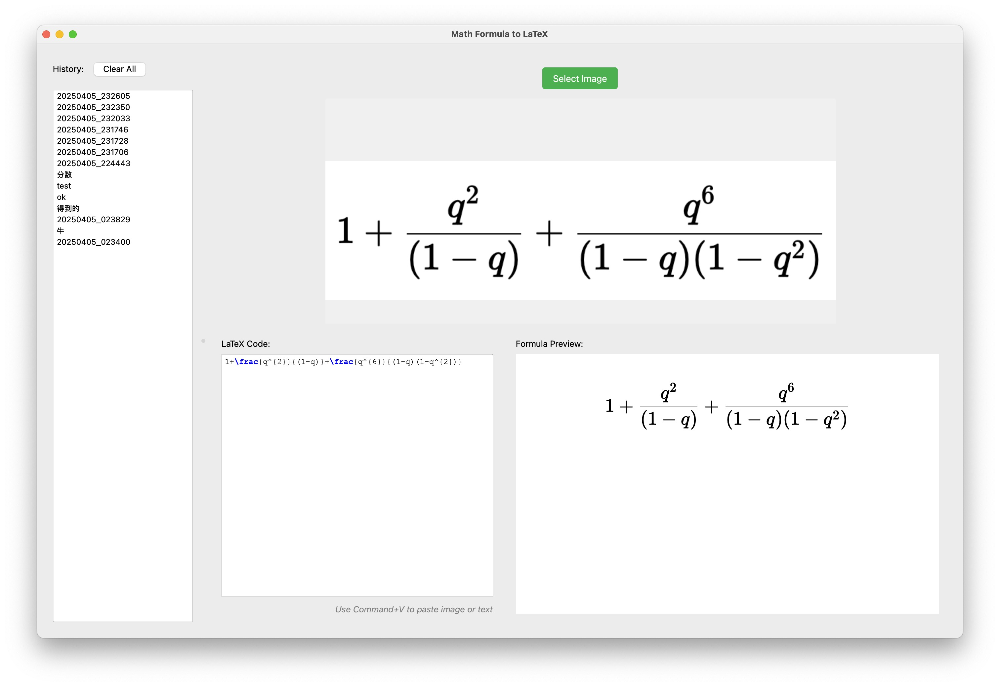

# 数学公式转LaTeX工具

这是一个使用PyQt6和PaddleX开发的应用程序，可以将数学公式图片转换为LaTeX代码。



## 功能特点

- 支持选择本地图片文件
- 显示识别结果和LaTeX代码
- 简洁直观的用户界面

## 安装要求

- Python 3.8+
- PyQt6
- PaddlePaddle
- PaddleX
- 其他依赖包（见requirements.txt）

## 安装步骤

1. 克隆或下载本项目
2. 安装依赖包：

```bash
pip install -r requirements.txt
```

## 使用方法

1. 运行程序：

```bash
python main.py
```

2. 点击"选择图片"按钮，选择包含数学公式的图片
3. 程序会自动识别图片中的文字并显示LaTeX代码

## 注意事项

- 建议使用清晰的数学公式图片
- 识别效果可能因图片质量而异
- 目前仅支持中文和英文识别
